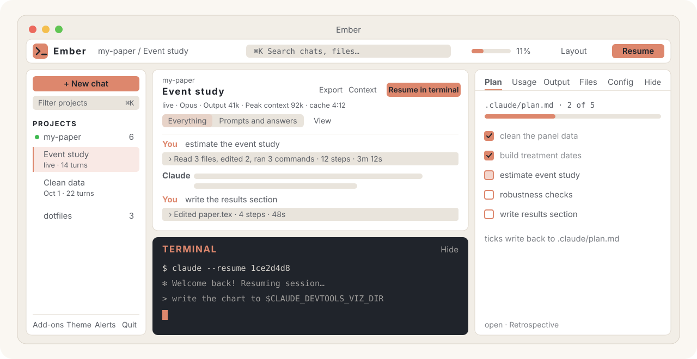

<p align="center">
  
</p>

<p align="center">
  <a href="https://github.com/PierreBeaucoral/ember/actions/workflows/ci.yml"></a>
  
  
  
  
  <a href="LICENSE"></a>
</p>

<p align="center">
  <b>Your Claude Code sessions, a real terminal, your plan and your token budget: one local window.</b><br>
  <sub>Formerly <code>claude-devtools-lite</code>. Same repo, new name; old links redirect.</sub>
</p>

<p align="center">
  <a href="#install-and-run">Install</a> ·
  <a href="#features">Features</a> ·
  <a href="#optional-add-ons">Add-ons</a> ·
  <a href="#usage">Usage</a> ·
  <a href="#security">Security</a>
</p>

---

Ember is a local dashboard for **Claude Code** sessions (timelines, thinking blocks,
tool calls, diffs, token usage, subagents, memory) with an **embedded terminal**,
a **live plan checklist**, a **file explorer** and a **visual output pane**, laid out
like RStudio.

It reads your transcripts **read-only** and runs entirely on your machine.
**No dependencies, no build step, no API keys, no telemetry.** It is one Python file,
one HTML file and the Python standard library, and it runs on **macOS, Linux and Windows**.

**[Download the app](https://github.com/PierreBeaucoral/ember/releases/latest)** for
macOS, Windows or Linux (nothing else to install), or run it from source:

```bash
git clone https://github.com/PierreBeaucoral/ember.git && cd ember && python3 server.py
```

<p align="center">
  
</p>

**Layouts.** A top bar sits on every screen: the Ember logo (back to Home), where you are
(project / conversation), a search field that opens the ⌘K palette, a compact 5-hour usage
meter, the **Layout** menu and **Resume** for the open conversation. The Layout menu has three:

- **Home**, where Ember opens unless a conversation is live: continue where you left off
  (Claude's last words, plan progress), start a new chat in a folder, recent chats across
  projects, and on the right the setup checklist, your usage in one sentence and the latest outputs
- **Workspace**, the default once a chat is open: the sidebar, the conversation with the
  terminal docked below it (**Hide** folds it), and an inspector with **Plan · Usage · Output ·
  Files · Config** tabs. **Ctrl+0** hides and shows the inspector
- **All panes**: every pane at once in a grid, as in RStudio, **resized by dragging** the splitters

Any pane can be **maximized (⛶)**, and the layout is saved between sessions. Simple mode
picks Workspace, full mode All panes. The coral accent marks navigation, focus and activity; diff,
warning and success colors keep their own meanings. **Ember Dark** and **Ember Light**
join the eight classic editor themes.

| | |
|---|---|
| 🔍 **See what really happened** | Every prompt, thinking block, tool call and diff, plus context-window compaction |
| ⌨️ **Jump back in** | `claude --resume` any session in an embedded PTY terminal, up to 6 tabs |
| ✅ **Shared plan** | `.claude/plan.md` as a live checklist that you and Claude both tick |
| 📊 **Know your budget** | 5-hour block, 7-day usage, P90 limit estimate, per-model breakdown |
| 🧩 **Know your context tax** | What every agent, skill, rule and MCP server in `~/.claude` costs per turn |
| 🖼️ **See the output** | Figures Claude writes to `$CLAUDE_DEVTOOLS_VIZ_DIR` render within 5 s |
| 📝 **Review what changed** | The git diff since HEAD or a branch; comment on a line, send the comments to Claude |

## Why

Claude Code writes a rich JSONL transcript for every session, but the CLI shows you a
condensed view of it. This reconstructs what actually happened: which files were read,
what each tool returned, what the model was thinking, how the context window filled up
and compacted, how many tokens each session burned — and lets you jump straight back
into any session in an embedded terminal.

## Features

**Session inspection**
- Every project and session under `~/.claude/projects/`, with real working-directory
  paths (decoded from the transcripts, not the lossy folder slugs)
- **One line per turn**: the prompt and the answer read in full, and the steps between
  fold into one summary line ("Read server.py, edited 2 files, ran 3 commands · 12 steps ·
  3m 12s"). Open it and every step is **one aligned row**: thinking with its first line, each
  tool call with its argument, an estimated token count (`~1.2k`), a status dot and **how
  long the tool took**; click a row to open it
- **A quiet session header**: project and title, **Export**, **Context** and **Resume in
  terminal**, then one line of meta (live, model, output, peak context, cache read, cache
  timer). **Everything / Prompts and answers** sets how much of each turn shows, and the
  **View** menu toggles thinking, tool calls, system messages and agents
- **Skills, slash commands, hooks and API errors are named, not dumped**: a skill's
  injected instructions become one `Skill /name ~11k` line instead of pages of text,
  `/improve config audit` shows as a command, failed hooks (`SessionStart · exit 127`)
  and API errors (`rate_limit`) show in red, and a message you typed while Claude was
  working appears where it landed
- **LaTeX renders as math** — `$$…$$`, `\[…\]`, `\(…\)` and `$…$` are typeset with
  KaTeX, so derivations and estimators read like a paper, not like source. Prices
  (`$5`) and shell variables (`$HOME`) are left alone
- **Markdown tables render as tables**, including the ragged ones Claude often emits
  (a `|---|---|` line shorter than its own header); math inside cells is typeset too
- **Subagents appear where they were launched**: each `Task` call is a coloured row with
  the agent type, model, outcome and cost (peak context, tool calls, wall time) before
  you open it. Opening shows its prompt, its result and the execution trace (the agent's
  own steps as lines, fetched on demand), so you keep your place in the parent session
- **What is in the context window**: a *Context +N* badge on each turn lists what that
  turn added (CLAUDE.md and rules files, the skill list, MCP instructions, @-files, tool
  output, thinking), and the **Context** panel shows the window as of the last request,
  by source, with ~token estimates, links to the turn, and how much of the real context
  the transcript does not account for (tool schemas, framing)
- **Prompt cache timer**: the session header counts down how long the prompt cache stays
  warm (5 min or 1 h, read from the transcript) and warns when the next prompt will
  re-write the whole context to cache
- **Real diffs** for `Edit`/`Write` calls, rendered from the recorded patch hunks; a
  Write that creates a file shows its content as added lines. **View → Open edits with
  their diff** opens every edit row on its own, diff first, raw input folded below
- **Compactions you can see**: a marker above each turn where the context was compacted
  ("From now on Claude works from a summary of everything above"), while every earlier
  turn stays readable here, unlike in the terminal
- **Context-window chart**: one bar per API request, stacked into cache read, cache
  write and uncached input, with automatic **compaction detection** (red bars where the
  context dropped sharply). **Click a bar to jump to that turn** in the timeline
- Token totals per session, deduplicated by request ID. **Jump to** chips for errors,
  agents, skills and compactions (and the keys **e**, **a**, **s**, **c**; **j**/**k** for turns) jump to the next
  one; the per-tool counts sit in the Context panel, where each chip jumps to the next call
  of that tool. Each turn has a **link** you can paste to reopen the session at that turn
- The sidebar shows each project's folder name, a live dot and its chat count, and each
  chat as *live* or its date with its turn count
- Sessions that ended on an **API error** (rate limit, expired login) say so in the sidebar
- **Subagent transcripts** open in the same viewer; agents not launched from the
  timeline (teammates, older layouts) get a header link named by agent type
- **The sidebar filters as you type** (project paths, and session titles in opened
  projects); **Enter** runs the full-text search — in the open project first (fast), with
  one click to widen to every project — and it covers **subagent transcripts** too.
  Results jump to the matching entry. Esc clears the filter
- **Live-follow**: a session that is still being written updates in place every few
  seconds (● live), scrolling with it only if you were at the bottom
- Reopening a session is instant: the parsed transcript is cached until the file changes
- Project **memory** files rendered in place: front matter as a type badge and
  description, and `[[name]]` / `[text](file.md)` links that open the linked memory file.
  A **memory check** lists files missing from the `MEMORY.md` index, files without
  name/description/type front matter, and links to memories not written yet
- Big transcripts (20 MB+, thousands of entries) load lazily and stay responsive
- **Keep your chats**: Claude Code deletes conversations older than 30 days unless
  `cleanupPeriodDays` says otherwise, silently, each time it starts. The setup checklist
  says so and sets it to 10 years in one click: only that key changes, after a copy of
  settings.json is saved (a symlinked settings.json is written through)

**Review changes**
- **Changes** in the session header (also on the end-of-session card and in the palette)
  shows the project's working tree in git: everything uncommitted, new files included, or
  everything since it left a local branch. A file list with +/− counts, the diff with old and
  new line numbers
- **Click a line to comment on it**, or move with ↑ ↓ (j/k) and press Enter; ⌘↵ adds the
  comment, Esc cancels, ← and → move between the file list and the diff. **Send to Claude**
  types every comment, `file:line [code] comment`, as one line into a Claude tab in that
  folder (you press Enter); with none open, it starts Claude there with the review as its
  first message. Tasks Ember starts this way never bypass permissions
- Read-only: only `git rev-parse`, `branch`, `merge-base`, `config`, `diff` and `ls-files`
  run, with the repository's own diff drivers, textconv, filters (`filter.*` in its
  `.git/config`) and fsmonitor switched off; your global ones, git-lfs for instance, keep
  working. Untracked symlinks and files whose names suggest secrets are listed, not read, and
  new files stop being read once they add up to 2 MB (an untracked data folder lists its
  files without loading them). Names with accents or spaces and your own diff settings
  (`noprefix`, `mnemonicPrefix`, `suppressBlankEmpty`) keep paths and line numbers exact
- For folders under your home folder, or the folder of a project Claude Code worked in. When
  git fails (a "dubious ownership" drive, a diff over 20 s) the dialog says why

**Token usage**
- The **Usage** pane leads with one sentence ("11% of your 5-hour limit") over its bar and
  reset time; the top bar carries a compact copy of that meter
- Current 5-hour block with reset countdown, output tokens today and over 7 days,
  an hourly sparkline, and a by-model breakdown
- **History**: a 30 / 90 / 180-day calendar heatmap of output tokens per day, with the
  split by project and by model
- **Official limits**, with the optional *Live limits* add-on: Claude Code's own 5-hour
  and 7-day usage %, their reset times, and the session's context % and cost, taken from
  the data Claude Code hands its statusline (your existing statusline keeps working)
- Without it, a limit bar compares the current block with the **P90 of your own
  historical blocks** (the [Claude-Code-Usage-Monitor](https://github.com/Maciek-roboblog/Claude-Code-Usage-Monitor)
  approach) — a measured estimate, not an official limit
- **Where the week went**: output over 7 days by who wrote it (your chats, each kind of
  subagent), and what each MCP server, skill and built-in tool put into the context window
  (estimated at ~4 characters a token; that context is paid again on every later request
  until a compaction). Claude Code's own `/usage` has the official breakdown

**Embedded terminal**
- Real PTY streamed to [xterm.js](https://xtermjs.org/): full TUI, colors, resizing
- Launch `claude` in any project's directory, or **resume any session** you're viewing
  (`claude --resume <id>`) with one click. **Fork** (the ▾ next to Resume, or the palette)
  starts a new conversation from where one left off (`--fork-session`), leaving the
  original as it was
- **Options for new chats** (Home, the top of the New chat menu, or the palette): model,
  effort, permission mode and an own git worktree, remembered and checked against the CLI's
  own choices. In a folder that is not a git repository the chat starts without a worktree
  and Ember says so; tasks Ember starts for a file (figure feedback, a review) never get one
- Up to 6 tabs. Quitting closes sessions **gracefully** (SIGHUP on POSIX,
  `CTRL_CLOSE_EVENT` on Windows) so Claude Code's `SessionEnd` hooks run before exit
- Terminal tabs **survive a page reload**: the page re-attaches to running shells and
  replays their scrollback
- On macOS/Linux, terminal writes stop after 2 seconds if the child is not accepting
  input. Failed input pauses typing and discards queued keystrokes; check for partially
  delivered text before choosing **Resume typing**. Unanswered input requests time out
  in the interface after 10 seconds. Discarded text is never replayed automatically.
- Text is kept readable in every theme, including Claude Code's own truecolor diff
  output on light backgrounds
- With the optional *Live activity* add-on, the sidebar shows what each session is
  doing right now, and a toast tells you when a session **waits for your permission**
- Terminals export `CLAUDE_DEVTOOLS_UI=1`, `CLAUDE_DEVTOOLS_VIZ_DIR`, and
  `CLAUDE_DEVTOOLS_URL`, so a session can tell it's running inside the dashboard

**Keyboard and navigation**
- **⌘K command palette** (Ctrl+K off macOS; also the search field in the top bar): opened
  empty, it suggests the next move (Resume, New chat, Jump to the next error, Go to Home),
  then your recent chats across projects, then everything else. `@` sessions, `#` full-text
  search, `/` files, `>` commands. ⌘P jumps to a session; `?` lists every shortcut
- Everything is reachable without a mouse: the project tree (arrow keys), tool and
  thinking blocks, plan tasks, tabs, menus and the splitters (arrow keys resize them);
  Ctrl+1–5 focus a pane, ⌘⇧M maximizes it, Ctrl+0 hides or shows the right side
- A **status bar** shows the connection, project and terminal at a glance; each segment
  jumps to its pane
- All ten themes meet WCAG AA contrast; notifications are announced to screen readers

**Plan pane**
- The inspector's **Plan** tab (a right-hand quadrant in All panes) shows the project's
  plan as a **live checklist**.
  It reads the first plan file it finds: `.claude/plan.md`, then the newest
  `quality_reports/plans/*.md`, then `PLAN.md` / `TODO.md` / `TASKS.md` / `ROADMAP.md`
- **Ticking a box rewrites the marker in the file** — so the plan is a shared artefact:
  Claude Code writes it, you tick it, the next session reads the ticks back. `[~]` and
  `[/]` render as *in progress*
- Follows the selected project **and the active terminal tab**, so switching consoles
  switches plans; re-reads the file every few seconds, so edits Claude makes show up live
- A file picker appears when a project has several plans; **＋ create** scaffolds
  `.claude/plan.md` when it has none

**Config inventory (Config tab)**
- What is actually installed in `~/.claude` — agents, skills, commands, rules, hooks,
  plugins, MCP servers — with the project's own `.claude/` alongside it when it has one
- Splits **resident** from **on demand**: `CLAUDE.md` and `rules/` (subfolders included,
  as Claude Code loads them) are pasted into every
  request, and so is one description line per agent/skill/command — their bodies are not.
  So a 45 kB command is nearly free until you invoke it, while a 10 kB rules file is a tax
  on every turn. The pane totals both and sorts each group heaviest-first
- **Flags hooks nothing points at**: files sitting in `~/.claude/hooks/` that no
  `settings.json` event references show in amber, and hooks registered from outside that
  folder still get a row
- **MCP servers are found where Claude Code actually keeps them** — `~/.claude.json`, both
  the global list and the per-project one — not `settings.json`, which usually has none
- Metadata only — never file contents, and never MCP server args or env, which routinely
  hold API keys (there is a test asserting this). Token figures are estimated at ~4 bytes each: rank with them, don't budget
- Click any row to open the file in the Files preview

**End-of-session retrospective**
- When a Claude terminal closes — including when you quit the app — the dashboard can
  run [`/improve`](https://github.com/TerenceBristol/claude-improve) over the transcript
  that just ended and drop a dated report in `~/.claude/improve-reports/<project>/`
- **Read-only by construction** (`--allowedTools Read Grep Glob`) and explicitly told to
  propose rather than apply, so it never edits your `CLAUDE.md` behind your back
- Rate-limited to one run per project per 3 hours, skipped for sessions under 20 KB, and
  guarded against recursing into its own session
- The newest report opens from **Retrospective** in the Plan pane header. Turn the whole thing
  off with `CDL_IMPROVE=0` in the environment
- Needs the command installed once:
  `mkdir -p ~/.claude/commands && curl -o ~/.claude/commands/improve.md https://raw.githubusercontent.com/TerenceBristol/claude-improve/main/improve.md`

**Session-end card**
- When a Claude terminal ends (it exits, or you close its tab), a card in the terminal
  pane sums the session up: minutes, output tokens, peak context, tool calls, the cost
  Claude Code itself reports (with *Live limits*), every file changed since the tab
  opened (commits made in the session plus uncommitted work, from git), and how many
  plan items were ticked
- **Add to session log**, its one main button, appends a pre-filled entry to
  `session_logs/YYYY-MM-DD.md` in the project: changes table, usage, plan progress, and the
  plan's open items as next steps. Decisions and LEARN entries are left blank for you,
  since Ember only writes down facts
- **Resume** and **Open** sit beside it as quiet links, and **Retrospective** once the
  `/improve` report lands

**Needs you**
- With the *Live activity* add-on, sessions **waiting on a permission prompt** appear above
  the projects with what they ask ("Bash: rm -rf build"), read from the session's own
  transcript, so the hook keeps recording metadata only. Then the sessions where it is
  **your turn**, for an hour. Click one to go to its terminal, or to open the conversation
  when it runs elsewhere. Subagents working in the background after Claude's turn, and other
  tools finishing while a prompt waits, do not change what the row says
- **Allow once** answers the prompt (it presses 1) only when Ember is sure what is being
  asked: the Ember tab was started with that very session, and the hook and the transcript
  name the same call. It is never offered on a question (AskUserQuestion), a plan approval or
  a subagent's prompt ("a subagent needs permission": answer it in the terminal), nor while
  two calls of the same tool are open. After you answer in the terminal itself, the row stays
  until that tool finishes, you deny it (with the Live activity hook reinstalled for 1.5), or
  the turn ends; a subagent's row until the turn ends
- Ember never types a prompt of its own (figure feedback, a review) into a terminal that is
  showing a permission prompt: a digit there would answer it

**Account profiles**
- Claude Code keeps one account per config folder: `~/.claude`, or any other through
  `CLAUDE_CONFIG_DIR`. Ember lists `~/.claude` and every `~/.claude-<name>` folder, with
  the account's e-mail, under **Account** at the bottom of the sidebar (shown once there
  are two)
- Switching shows that profile's chats, usage, config and plans, and new terminals start
  with `CLAUDE_CONFIG_DIR` pointing at it; terminals already open keep their account.
  **New account profile** creates `~/.claude-<name>` and opens a terminal to sign in
- Ember started with `CLAUDE_CONFIG_DIR` set shows that folder. The *Live limits* figures
  only come from sessions of the profile on screen. A terminal keeps the account it started
  with, end-of-session card and retrospective included. Add-ons install into `~/.claude`, so
  in another profile the Add-ons pane lists them as missing (Claude Code there does not load
  them either), and the retrospective runs only where `/improve` is installed

**Notifications (Alerts)**
- Off by default. Turned on with **Alerts** at the bottom of the sidebar, Ember tells you through your OS when a session **waits for
  your permission** or **Claude finishes its turn**, but only while Ember is in the
  background, and at most once per session every 15 seconds
- Works in the browser (it asks for permission once) and in the macOS app (native
  notifications; click one to bring the window back). Needs the *Live activity* add-on,
  which is how Ember sees your sessions. Browsers slow down background tabs, so a
  notification can lag by up to a minute in a tab that has been hidden for a while

**Guard log**
- With the *Session guards* add-on, `/careful` blocks destructive shell commands
  (`rm -rf`, `git push --force`, `git reset --hard`, `git clean -f`, `DROP TABLE`, …) and
  `/freeze paper/` blocks edits outside the folders you name. Claude is told why and
  can take another route
- Each block shows as a toast and in **Guard log** at the top of the Config tab:
  guard, rule, tool, project, time. Only that metadata is kept, **never the command**

**Share a session (Export)**
- **Export** in the session header saves one self-contained HTML file to your
  Downloads folder: the timeline as Ember renders it, in your current theme, with no
  scripts. Tick what goes in: thinking blocks, tool inputs and results,
  system messages
- **Hide my home folder and user name** (on by default) replaces `/Users/<you>/…`
  paths with `~/…` and your user name with `user`, including in `ls -l` output.
  Tool results can still contain file contents, so read the file before you send it

**Output pane and file explorer**
- The **Output** pane (formerly Viz) shows a watched folder: any `.html`, `.png`, `.svg`,
  `.md`, `.pdf`, `.csv` written there appears within 5 seconds and renders automatically. Tell a running Claude session
  *"write the chart to $CLAUDE_DEVTOOLS_VIZ_DIR"* and watch it appear.
- Interrupted folder scans are retried once, with one scan in flight per page.
  Persistent failures show a warning while keeping the last preview visible; the
  warning clears after a successful refresh.
- Projects with a [graphify](https://github.com/anthropics/skills) knowledge graph
  (`graphify-out/graph.html`) display it automatically; projects without one are asked
  whether to build one (**Build graph** launches the skill), and **Don't ask again for
  this folder** silences the prompt for that project
- Images preview scaled to fit the pane (click to expand them full-size)
- A Files pane that follows the selected project, previews files, copies paths, opens a
  shell in any folder, or points the Output watcher at it
- It also follows the **active terminal tab**: switch between two Claude sessions and
  the explorer jumps to that session's project root — or back to wherever you had
  browsed to in it
- **Click a preview to expand it**: the pane goes full-screen (Esc, or ⛶, restores it),
  which is where a knowledge graph or a wide figure is actually usable

**Figure and PDF comments** (after [exhibit-review](https://github.com/paulgp/exhibit-review))
- On any image **or PDF**, in the Output pane **or the Files pane**, **Comment** opens it
  full-size: click a spot or drag a box, then write what should change. Marks are
  numbered, and each comment is *open*, *resolved* or *wontfix*. So any figure or
  compiled paper in the repo can be marked up, not only what lands in the Output folder
- **PDFs** open page by page (‹ ›), drawn by the bundled pdf.js, so you point at a spot on
  page 4 exactly as on a PNG. Each comment remembers its page; the list shows `p.4`, and
  picking a comment from another page turns to it
- Comments save automatically to `.review/<figure>.json` next to the figure, with
  coordinates as fractions of the image (so they survive a re-render at another size) and
  the image's sha256. The figure itself is never written
- **Send to Claude** types a prompt into the active Claude tab (you press Enter), or starts
  a session in the project: find the script behind the figure (or the LaTeX / Quarto
  source behind the PDF), apply the open comments, re-render, mark them resolved in the JSON
- When the file changes after comments were saved, a **file regenerated** badge warns
  that old marks may no longer line up. Saves refuse to overwrite a newer revision (for
  example one Claude just wrote)

**Themes**
- **Theme** at the bottom of the sidebar switches the whole app, terminal included: Ember
  Dark (default), Ember Light, GitHub Dark and GitHub Light lead the menu; Solarized Dark /
  Light, Dracula, Monokai, Tomorrow Night and Cobalt — the editor themes RStudio users
  know — are under **More themes**. The choice is remembered per browser
- The chrome uses words, not emoji: Add-ons, Theme, Alerts, Quit, Export, Context
- Claude Code picks its own colours: with a light theme here, run `/theme light` there

## Optional add-ons

The dashboard runs on its own, but two features use Claude Code add-ons:
**graphify** (knowledge graphs in the Output pane) and **/improve** (the end-of-session
retrospective). **Add-ons**, at the bottom of the sidebar, opens a pane that shows which add-ons from
[`addons.json`](addons.json) are installed, with a tickbox for each missing one.
It also opens by itself at launch while something is missing; tick
**Don't show at launch** to stop that until the list of missing add-ons changes.

- Three add-ons ship inside this repo (`tools/devtools_hooks.py`, stdlib only):
  **Live limits** wraps your statusline to record Claude Code's official usage figures;
  **Live activity** adds an async hook that records event *metadata* (event, tool
  name, session — never tool inputs or outputs); **Session guards** adds the PreToolUse
  hook that makes `/careful` and `/freeze` block (it reads the guard file those commands
  write, `.claude/state/session-guards.json` in the project). All three edit
  `~/.claude/settings.json`, save a copy first as `settings.json.bak-devtools`, and undo
  with `python3 tools/devtools_hooks.py uninstall-statusline` / `uninstall-events` /
  `uninstall-guard` (with the downloaded Windows or Linux app:
  `Ember devtools_hooks.py uninstall-…`). They run with the same Python as Ember
  (the app's own, in a download), so no system Python is needed
- Ticked add-ons install in a **visible terminal tab**, with the exact commands shown
  in the pane first. Nothing installs without that click
- **Ticking an installed add-on reinstalls it cleanly** (plugin uninstalled and
  reinstalled, skill folder re-cloned, `uv tool install --force` for graphify) — the fix
  when an install was interrupted, e.g. by closing the app mid-way
- ponytail and codex need **Node.js**: their hooks run `node` on every prompt, so without
  it Claude shows a "UserPromptSubmit hook error" (typical on a fresh Windows PC)
- **Prerequisites are part of the install.** When an add-on needs a program you don't
  have (Node.js, uv, Git, the Codex CLI…), its row says "Also installs: …" with the command
  for *your* OS (Homebrew or the official script on macOS, apt on Debian/Ubuntu, winget
  on Windows — or, on a PC without winget, the program's official installer downloaded
  with PowerShell), and Install runs it first. A freshly installed program usually isn't on
  PATH in the same window, so the installer works in rounds: prerequisites, then — once
  the app actually sees them — the add-ons, in a fresh terminal. winget, brew and sudo
  may ask a question in that terminal; answer it there
- Only when there is no automatic route for your OS does a row say what to install and
  link to it, and can't be ticked
- Statuses refresh on their own while the pane is open. Claude sessions already running
  don't pick up a new skill or plugin: start a new session afterwards
- graphify reads the whole project folder. On a big data folder (or Dropbox online-only
  files) the first step can take minutes: list data folders in a `.graphifyignore`
  (same syntax as `.gitignore`), or run `/graphify <code-subfolder>`
- The list also suggests add-ons the dashboard doesn't use itself: ponytail,
  frontend-design, codex, crossref, dream, **Anthropic's document skills** (PDF, Word,
  Excel, PowerPoint), **Playwright MCP** (Claude drives a browser, e.g. to check a report
  it built) and **Context7 MCP** (current library docs; hosted, no key needed). The two
  MCP servers are added at user scope with `claude mcp add --scope user`. Edit
  `addons.json` to change what it offers. The app only ever runs commands written in
  that file
- Without `/improve` installed, the retrospective simply doesn't run; without graphify,
  the graph prompt offers to set it up instead of launching an unknown command

## Install and run

Ember needs an existing Claude Code installation (`~/.claude`). Two ways to run it:

### Download the app

From [the latest release](https://github.com/PierreBeaucoral/ember/releases/latest),
no Python or anything else to install. Each app opens Ember in its own window.

| OS | File | First launch |
|---|---|---|
| macOS (Apple silicon) | `Ember-macos-arm64.dmg` | Open it, drag **Ember** to Applications, open it from there. macOS says it can't check the app: **System Settings → Privacy & Security → Open Anyway**, or once in Terminal: `xattr -dr com.apple.quarantine /Applications/Ember.app` |
| macOS (Intel) | `Ember-macos-x86_64.dmg` | The same |
| Windows 10 / 11 | `Ember-Setup-x64.exe` | Run it: no admin rights needed, it adds Ember to the Start menu (and the desktop if ticked) and to **Settings → Apps** for uninstalling. SmartScreen: **More info → Run anyway**. No-install copy: `Ember-windows-x64.zip`, unzip anywhere and open `Ember.exe` |
| Linux (x86-64) | `Ember-linux-x86_64.AppImage` | `chmod +x Ember-linux-x86_64.AppImage`, then open it; `./Ember-linux-x86_64.AppImage --install` adds it to your applications menu. Without FUSE: `--appimage-extract-and-run`. Or the folder: `tar -xzf Ember-linux-x86_64.tar.gz`, then `Ember/Ember --install` |

- The warnings appear once because the apps are not code-signed (a paid certificate).
  They are built from this repository by
  [the release workflow](.github/workflows/release.yml), in public
- **Window or browser.** The apps open their own window by default. To use your browser
  instead, run **Desktop app: open the browser at launch** from the command palette
  (⌘K / Ctrl+K); the app then hands your browser a login link at each launch and quits.
  **Open Ember in your browser** does it once, from the window
- **Updates.** Once a day Ember asks GitHub for the latest release and shows a notice
  with a download link when there is one. Nothing installs by itself. **Check for
  updates** and **Turn off the daily update check** are in the palette
- The Windows window uses Edge WebView2, part of Windows 10 and 11. The Linux window uses
  WebKitGTK; where it is missing, the app opens your browser instead and says why (the
  details are kept in `window.log` in Ember's data folder)
- Only the downloaded app (`Ember.exe`, `Ember`, `Ember.app`) opens its own window. Run
  from source (`Ember.cmd`, the `install.ps1` shortcuts, `python server.py`), Ember opens
  in a browser window: Edge or Chrome in app mode, else your default browser
- Keep the app where you first open it: the Live limits, Live activity and Session
  guards add-ons point Claude Code at it. After moving it, tick them again in Add-ons
- The apps keep the Output folder in Ember's data folder (`~/Library/Application
  Support/claude-devtools/viz` on macOS, `%APPDATA%\claude-devtools\viz`,
  `~/.config/claude-devtools/viz`); sessions find it through `$CLAUDE_DEVTOOLS_VIZ_DIR`

### From source

Requires **Python 3.9+**.

```bash
git clone https://github.com/PierreBeaucoral/ember.git
cd ember
python3 server.py
```

In a second terminal, get a login link and open it:

```bash
python3 server.py --launch-url      # prints http://127.0.0.1:3456/launch?c=… (single use, 60 s)
```

On Windows, type `python` instead of `python3` (`python3` there is often the
Microsoft Store stub). The server keeps running until Ctrl+C; opening
`http://127.0.0.1:3456/` without a login link shows a lock screen.

That's the whole setup — but each platform also has a double-click launcher that does
this for you:

### macOS

```bash
bash packaging/macos/build-app.sh          # self-contained: the release build
bash packaging/macos/build-app.sh --dev    # thin: runs this checkout's server.py
```

Builds `Ember.app` — a native window (WebKit wrapper, no Electron)
with a Dock icon and ⌘Q. Drag it to `/Applications`. It starts the server if needed and
never spawns a duplicate. The default build copies the dashboard and a standalone
Python 3.13 (pinned, checksum-verified, ~25 MB downloaded once) into the app, so it runs
on any Mac; the `--dev` build uses your `python3` and your edits without a rebuild.

### Linux

```bash
launchers/linux/install.sh
```

Adds "Ember" to your application menu (per-user, no `sudo`). Opens an app-mode
browser window (Chrome/Chromium/Brave/Edge) or your default browser. Full feature parity
with macOS.

### Windows

```powershell
powershell -ExecutionPolicy Bypass -File launchers\windows\install.ps1
```

Creates Desktop and Start-menu shortcuts with the app's own icon
(`launchers\windows\claude-devtools.ico`; re-run the script to refresh existing
shortcuts), or double-click
`launchers\windows\Ember.cmd`. The old `Claude DevTools.cmd` still forwards to Ember.
These open Ember in a browser window (Edge or Chrome in app mode). For Ember's own
window, install `Ember-Setup-x64.exe` from the [latest release](https://github.com/PierreBeaucoral/ember/releases/latest)
— and replace the old shortcuts, which still point at the browser launcher.

The embedded terminal works on **Windows 10 1809+** through ConPTY, driven via `ctypes`
— still no third-party packages. Verify it on your machine:

```
python tools\selftest_windows.py
```

On older Windows builds the server detects the missing API, explains it in the terminal
pane, and everything else keeps working.

### Updating from Claude DevTools

Rebuild the macOS app or rerun your platform's installer to refresh its name and icon.
On macOS, use the newly built `Ember.app` in place of `Claude DevTools.app`; the build
does not remove your old app. Windows installation replaces this checkout's old
shortcuts; Linux updates the existing desktop entry.

Saved themes are preserved. Choose **Theme → Ember Dark** or **Ember Light** to adopt the
new palette. Existing data directories, authentication, browser preferences and
`CLAUDE_DEVTOOLS_*` environment variables keep their original identifiers for
compatibility; no session migration is needed.

The repository moved from `claude-devtools-lite` to `ember`, and GitHub redirects the
old URL. To point an existing clone at the new name:

```bash
git remote set-url origin https://github.com/PierreBeaucoral/ember.git
```

You don't need to rename the folder: the launchers look for `ember/` first and then
fall back to `claude-devtools-lite/`.

## New to Claude Code?

If you know Claude from the app and want it to work on real files, Ember walks you in:

- **A setup checklist on Home** (*Finish setting up*, until it is done): is Claude Code
  installed (one-click official installer, run in a terminal you can watch), are you
  signed in, have you started a chat, are the add-ons Ember uses installed.
- **Simple mode**: plain words ("New chat with Claude", "Continue this conversation"),
  labelled buttons, the Workspace layout, expert panels hidden, and a **?** next to every
  term (tokens, 5-hour block, thinking, tool calls…) with a one-sentence explanation.
  Offered at first launch; switch any time from **Settings** on Home or **? Help** in the
  status bar.
- **A one-minute guided tour** of the screen.
- **A ten-minute practice project**: `~/Ember-practice` with a small made-up dataset and a
  six-step checklist in the Plan tab (ask Claude about the folder, get a chart, comment
  on it, read what Claude did, check your usage). Steps tick themselves as Ember sees them
  happen. It uses a little of your Claude usage, like any chat.

All of it lives under **? Help** (bottom right) and in the ⌘K palette.

## Usage

| Action | How |
|---|---|
| Get help as a beginner | **? Help** in the status bar: tour, practice project, simple mode, glossary |
| Go back to the start page | The Ember logo in the top bar opens **Home** |
| Switch layout | **Layout** in the top bar: Home, Workspace or All panes |
| Hide or show the inspector | **Ctrl+0**, or **Hide** in its tab row |
| Browse a project | Click it in the sidebar; sessions expand underneath |
| Inspect a session | Click a session — the conversation, context chart and token totals load |
| Hide noise | **Prompts and answers** above the conversation; **View** toggles each kind of step |
| Filter the sidebar | Type in the **Filter projects** box — the tree narrows as you type |
| Search everything | Type in the filter box, press Enter, click a result to jump to it |
| Open the CLI in a project | Hover a project → **+ chat** |
| Start a session anywhere | **＋ New chat** at the top of the sidebar → pick a project, `~`, or browse for any folder |
| Resume a session | Open it → **Resume in terminal** (or **Resume** in the top bar) |
| Show a figure from a session | Have it write into `$CLAUDE_DEVTOOLS_VIZ_DIR` |
| Comment on a figure | Show it in the **Output** tab → **Comment** → click or drag, type, **Send to Claude** |
| Change the theme | **Theme** at the bottom of the sidebar |
| Tick off a plan step | Click it in the **Plan** tab — the markdown file is updated |
| Point the plan pane elsewhere | Use its file picker, or **＋ create `.claude/plan.md`** |
| Read the last retrospective | **Retrospective** in the Plan header |
| See what's loaded into every turn | The **Config** tab |
| Expand a preview | Click the preview itself (Esc restores) |
| Maximize a pane | **⛶** in its header (click again to restore) |
| Resize panes | Drag the splitters; sizes persist |
| Quit | **Quit** at the bottom of the sidebar (or ⌘Q in the macOS app) |
| Use the browser instead of the app window | ⌘K → **Desktop app: open the browser at launch** (or **Open Ember in your browser** once) |
| Check for a new version | ⌘K → **Check for updates** |

Green dots mark projects whose transcripts changed since you last opened them, and a
toast appears when a background session finishes something.

### Making Claude aware of the dashboard

Sessions started from Ember's terminal already know about it: Ember passes the block
below with `--append-system-prompt`. Add it to your `~/.claude/CLAUDE.md` only if you
also want sessions started **outside** Ember to use the Output folder and plan file; once
your CLAUDE.md mentions `CLAUDE_DEVTOOLS_UI`, Ember stops appending its own copy, so
you never pay for it twice.

```markdown
## Ember UI awareness

When `CLAUDE_DEVTOOLS_UI=1` is set, this session runs inside the Ember
dashboard. To show the user a visual output (figure, chart, HTML report), also write a
self-contained file into `$CLAUDE_DEVTOOLS_VIZ_DIR` — it renders automatically in the
Output pane. Prefer inline-only `.html`, `.png`, or `.svg`, with descriptive filenames.

Keep the working plan in `.claude/plan.md` as markdown checkboxes (`- [ ] step`). The
dashboard's Plan pane renders it and writes ticks back into it, so re-read it before
planning and update it as steps complete.

Figure and PDF feedback lives in `.review/<file>.json` next to the figure or PDF
(coordinates are fractions of the image, origin top-left; on a PDF each comment also
has a 1-based `page`, and the fractions are of that page). Before regenerating a figure
or rebuilding a PDF, read its open comments; after applying one, set its `status` to
`"resolved"` in that file.
```

## Security

The dashboard can spawn shells, so it is built to be safe on a shared machine:

- Binds to **127.0.0.1** only. It **never modifies your transcripts or memory**, and
  changes one Claude Code setting, only when you click **Keep them for 10 years**:
  `cleanupPeriodDays`, after saving a copy of settings.json. Otherwise it writes its own
  state file, the plan checkbox you click (see below), `~/.claude/improve-reports/` when a
  retrospective runs, and, only when you click, a session-log entry, an export, figure
  comments (`.review/`) and a new account profile folder (`~/.claude-<name>`)
- **Account switches** accept only folders Ember listed itself (`~/.claude`,
  `~/.claude-<name>`, the `CLAUDE_CONFIG_DIR` it started with), and profile names are
  letters, digits, `-` and `_`. **New-chat options** reach the CLI only as values from its
  own lists (a model name is checked against a strict pattern). **Review changes** runs
  read-only git with the repository's own diff drivers, textconv and fsmonitor switched off
- **Session-log writes** go only to `session_logs/<date>.md` in the project of a Claude
  terminal this server ran: the page names the terminal, never a path. **Exports** go
  only to `~/Downloads`, under a sanitised file name; the page supplies the name and the
  HTML, never the folder
- **Plan writes are narrow**: only a file the pane discovered for the open project, only
  the `[ ]` / `[x]` marker on one line, and only when the line's text still matches what
  the UI displayed — a stale click is refused rather than applied to the wrong task
- Every `/api` route requires a **token** (generated once, stored `0600` in your OS's
  app-data directory, outside this repo). The launchers trade it for a **one-time, 60 s
  login code** and hand the browser only that code, which becomes a same-site cookie — the
  token never appears in a URL, a browser's command line or the server log. Before sending
  the token, the launcher checks (HMAC challenge) that the server on the port really holds it
- The page runs under a strict **Content-Security-Policy**: scripts only from `/vendor` and
  the one inline script, pinned by its SHA-256, so injected markup cannot execute
- **CSRF guard** (JSON content type + origin allowlist) and a **Host allowlist**
  (DNS-rebinding protection)
- File browsing is confined to `$HOME`, blocks path traversal and symlink escapes, and
  **refuses credential-shaped files** (`.env*`, `*secret*`, `*token*`, `id_rsa`,
  `*.pem`, `.netrc`, `hosts.yml`, …)
- HTML previews render in a **sandboxed iframe** with an opaque origin, and the server
  also sends them with a `sandbox` CSP, so a previewed file cannot reach the dashboard's
  API or your token even when opened directly

- The **only request Ember makes on its own** is the daily update check: an HTTPS
  request to `github.com/PierreBeaucoral/ember/releases/latest`, which carries nothing
  about you or your sessions. Turn it off from the palette, or set `CDL_UPDATES=0`

**Do not run this with `--host 0.0.0.0`.** That would offer a shell to your network; the
server prints a warning if you try.

## Development

The canonical icon geometry and colors live in `packaging/macos/make_icon.py`.
After editing the mark, run `python3 packaging/macos/make_icon.py --sync` (requires
Pillow) to regenerate the Linux SVG, Windows ICO, favicon, and in-app mark together.
The macOS builder uses the same generator for its ICNS. The shipped assets need no
extra runtime dependencies. Legacy platform asset filenames are intentional.

```bash
python3 -m pytest tests/ -q      # server suite (also run by CI on macOS, Linux, Windows)
```

They cover the transcript-parsing invariants (usage dedup by request ID, tool pairing,
patch rendering, sidechains, compaction detection), 5-hour block grouping, path-safety
guards, the secret deny-list, the HTTP auth/CSRF/Host layer, and the Windows backend
helpers.

**Releases.** Push a tag `vX.Y.Z` (after setting `VERSION` in `server.py` and
`CITATION.cff`): [the release workflow](.github/workflows/release.yml) builds the three
apps (macOS on Apple silicon and Intel), wraps them in installers (`.dmg`, Inno Setup
`packaging/windows/ember.iss`, AppImage `packaging/linux/build-appimage.sh`), smoke-tests
each, and attaches them to the release. **Actions → release → Run workflow** does the
same without publishing (a dry run; the files stay as artifacts).

| File | Role |
|---|---|
| `server.py` | HTTP server, JSONL parsing, usage aggregation, PTY terminals |
| `winconpty.py` | Windows ConPTY transport (ctypes, no dependencies) |
| `index.html` | Single-page UI (vanilla JS, no framework) |
| `native/main.swift` | macOS standalone window (WebKit) |
| `native/window.py` | Windows / Linux window (pywebview); frozen into `Ember.exe` / `Ember` with the server and the tees by `packaging/pyinstaller/build.py` |
| `tools/smoke_app.py` | Smoke test of a built app (server, page, tees, window), run by the release workflow |
| `launchers/`, `packaging/` | Per-platform launchers and app builders |
| `vendor/` | xterm.js 5.5.0 + fit addon and KaTeX 0.16.11 with its woff2 fonts (both MIT), and pdf.js 3.11.174 (Apache-2.0, `pdfjs-LICENSE.txt`; loaded only when a PDF is opened for comments), vendored for offline use |
| `tests/` | `pytest tests/` for the server; `node tests/test_frontend.js` for the UI |

## Prior art

Inspired by [claude-devtools](https://github.com/matt1398/claude-devtools) (Electron, far
more featureful) and [Claude-Code-Usage-Monitor](https://github.com/Maciek-roboblog/Claude-Code-Usage-Monitor)
(the P90 usage-baseline idea). This one is deliberately tiny: two main files, standard
library only, hackable in an afternoon.

## Support

If this tool saves you time, you can [buy me a coffee via PayPal](https://www.paypal.me/pb63000).
Entirely optional — bug reports and pull requests are just as welcome.

## License

MIT — see [LICENSE](LICENSE). Bundles [xterm.js](https://github.com/xtermjs/xterm.js)
(MIT) and [KaTeX](https://github.com/KaTeX/KaTeX) (MIT). Not affiliated with Anthropic.
